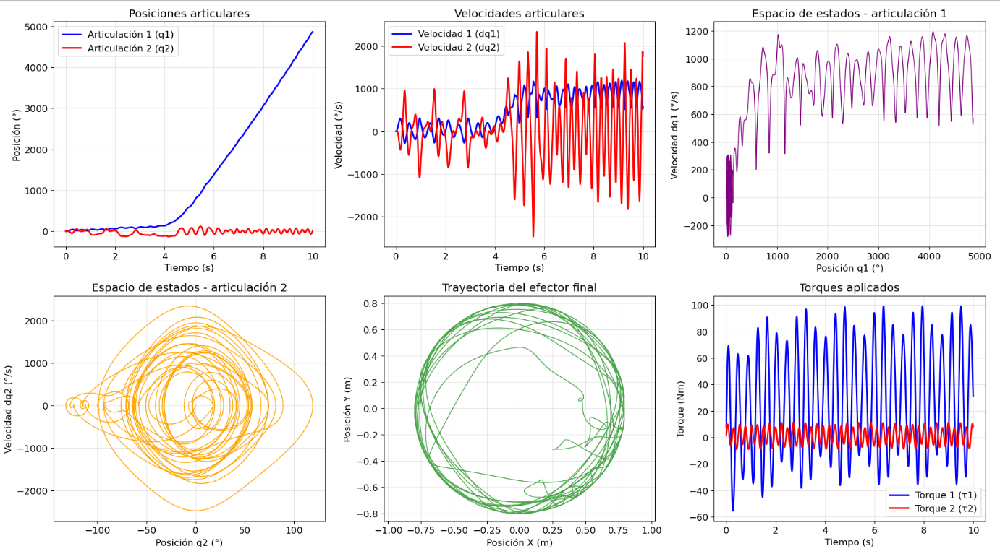

# Simulación de robot manipulador planar de 2 GDL


Simulación completa de un robot manipulador planar de 2 grados de libertad implementando el formalismo de Euler-Lagrange.

## Resultados de la simulación



## Objetivo

Implementar y simular la dinámica de un robot planar de 2 GDL utilizando las ecuaciones de Euler-Lagrange, considerando:
- Modelado dinámico completo
- Fricción viscosa y de Coulomb
- Torques de entrada específicos
- Visualización de resultados

## Características Técnicas

### Parámetros del robot
- **Eslabón 1-Hombro:** m₁=5.0kg, l₁=0.5m, I₁=0.16kg·m²
- **Eslabón 2-Codo:** m₂=3.0kg, l₂=0.3m, I₂=0.08kg·m²
- **Gravedad:** g=9.81 m/s²

### Modelo dinámico
- **Matriz de inercia M(q)**
- **Matriz de Coriolis C(q,ḋq)**
- **Vector gravitacional g(q)**
- **Fricción viscosa y de Coulomb**

## Instalación y uso

1. **Clonar el repositorio:**
   ```bash
   git clone https://github.com/danielareyes23/simulacion-robot-2gdl.git

   cd simulacion-robot-2gdl
